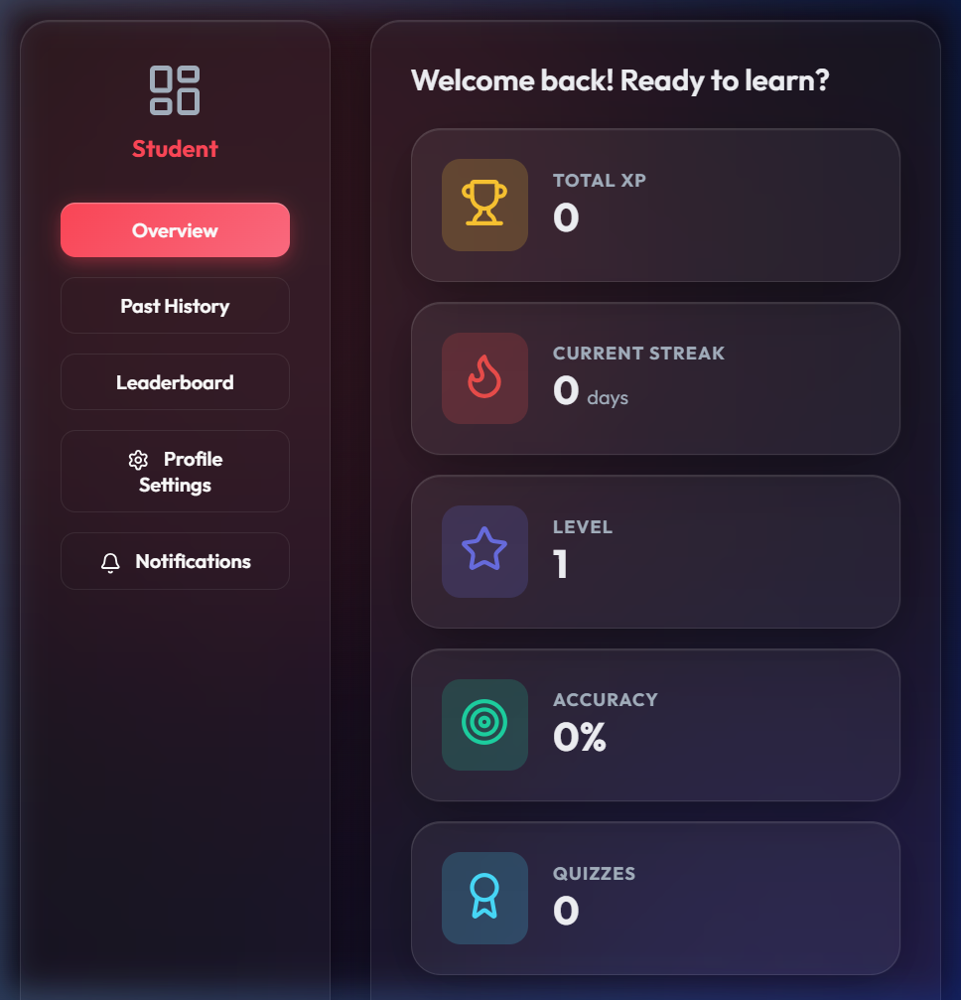
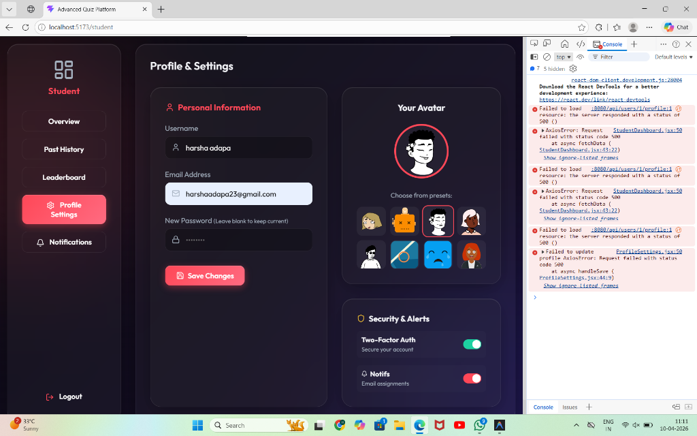

<div align="center">
  
  <h1>🚀 Advanced Quiz & Gamification Platform</h1>
  <p><strong>A Full-Stack Interactive Learning Arena by Harsha Adapa</strong></p>
  <p>
    <strong>Internship Project Submission</strong><br/>
    Developed independently by <b>Harsha Adapa</b>. Built focusing on Real-Time Analytics, Gamification features (XP, Levels, Badges), and Premium UI/UX.
  </p>
</div>

## 1. Project Abstract
The Premium Gamified Quiz Platform is a full-stack, industry-standard web application designed to revolutionize the remote learning experience. Unlike traditional testing systems, this platform employs progressive GAMIFICATION elements (XP accumulation, dynamic badges, and streak mechanics) to incentivize user engagement. Built with a highly responsive React frontend and a secure Spring Boot backend, the architecture supports distinct user roles (Student and Teacher) seamlessly, making it an optimal solution for modern educational institutions.

## 2. Key Features

### For Students (Learners)

*   **Gamified Dashboard:** Interactive overview featuring Total XP, Level progression, exact accuracy percentages, and Daily Streaks.
*   **Live Assessment Engine:** Fully timed quizzes with dynamic progress bars, smooth question transitions, and confetti celebrations upon achieving perfect scores.
*   **Performance Analytics:** Subject-specific strength charts and chronological graphs mapping historical submission performance using Recharts.
*   **Badge System:** Earnable achievements dynamically awarded by the backend rules engine.
*   **Glassmorphic UI:** A heavily stylized, premium user interface utilizing a modern dark mode layered with frosted glass effects.

### For Teachers (Administrators)
*   **Quiz Authoring:** Create, manage, and publish structured quizzes containing robust categorization and difficulty settings.
*   **Analytics Hub:** Gain real-time insights into global student performance, completion rates, and average scoring matrices.
*   **Class Observation:** Inspect specific user profiles and assess engagement levels to optimize learning. 

### Core System Features

*   **JWT Security:** Fully encrypted password storage and stateless JSON Web Token authentication locking down protected API endpoints.
*   **RBAC (Role-Based Access Control):** Dedicated interceptors explicitly verifying user credentials and bouncing unauthorized access to specific dashboard areas.
*   **Responsive Metrics Validation:** Built-in CORS and cross-origin resource handling for frictionless component rendering.

---

## 3. Technology Stack

### Frontend (Client-Side)
*   **Framework:** React 18 / Vite
*   **Routing:** React Router DOM
*   **Styling:** Vanilla CSS (Glassmorphic Design System)
*   **Data Visualization:** Recharts (Line & Bar charts)
*   **HTTP Client:** Axios (Custom interceptors for Bearer Tokens)
*   **Iconography:** Lucide React
*   **Animations:** Canvas-Confetti

### Backend (Server-Side)
*   **Framework:** Spring Boot 3.2+ (Java 17/21)
*   **Security:** Spring Security & JWT (JSON Web Tokens)
*   **ORM:** Hibernate / Spring Data JPA
*   **Database:** MySQL Server
*   **Transaction Management:** `@Transactional` automated bounding
*   **Build Tool:** Maven

---

## 4. Architectural Overview

The application utilizes a **Three-Tier Architecture**:
1.  **Presentation Tier:** The React Application operates asynchronously, sending RESTful HTTP requests carrying `Authorization: Bearer <token>` identifiers.
2.  **Application Tier:** The Spring MVC dispatch forwards traffic to `Controllers` -> `Services` -> `Repositories`. Data transfers are decoupled utilizing rigid **DTOs (Data Transfer Objects)** to prevent database entity leakages.
3.  **Data Tier:** A normalized MySQL instance storing persistent relation trees (e.g., Many-to-Many mappings for User Badges, One-to-Many mappings for Quiz Questions).

---

## 5. Database Schema Snapshot

The Database utilizes `FetchType.LAZY` optimization to conserve memory natively, bound strictly to the `quiz_app` schema.
*   **`users`**: Stores `id`, `username`, `password` (hashed), `role`, `xp`, `level`, `current_streak`, `last_active_date`.
*   **`quizzes`**: Stores `id`, `title`, `teacher_id` (FK), `time_limit_minutes`, `category`, `is_published`.
*   **`questions`**: Maps back to Quiz ID, tracks `text`, `type`, `explanation`.
*   **`options`**: Maps back to Question ID, tracks `text`, `is_correct` boolean.
*   **`quiz_attempts`**: Joining table capturing analytics; `user_id`, `quiz_id`, `score`, `start_time`, `end_time`.
*   **`badges`** & **`user_badges`**: Global badge definitions and a Many-to-Many tracking table for assigning unlocked badges to specific learners.

---

## 6. Core API Endpoints

### Authentication `/api/auth`
*   `POST /signup`: Registers a new user with Bcrypt password encoding.
*   `POST /signin`: Validates credentials and generates a secure JWT.

### Student Flow `/api/student`
*   `GET /quizzes`: Fetches all `isPublished=true` quizzes available to take.
*   `POST /attempt`: Submits a graded quiz, updates XP, increments streaks, and evaluates new badge logic criteria.
*   `GET /attempts`: Retrieves chronological history of completed tests.

### Profile & Leaderboard `/api/users`
*   `GET /{id}/profile`: Fetches aggregated UserProfileDTO comprising accuracy calculations and XP distributions.
*   `PUT /{id}/profile`: Enables editing for Avatars, Usernames, and Emails.
*   `GET /leaderboard`: Compiles a globally sorted list of all active participants via competitive ranking.

---

## 7. Local Installation & Setup Instructions

### Prerequisites
*   Node.js (v18+)
*   Java Development Kit (JDK 17+)
*   MySQL Server (Running on port 3306)

### Step 1: Database Setup
1. Open MySQL and execute: `CREATE DATABASE quiz_app;`
2. The schema will be auto-generated by Hibernate mapping upon the first boot.

### Step 2: Backend Initialization
1. Navigate to the backend directory: `cd backend`
2. Verify `application.properties` credentials (`spring.datasource.username` & `password`).
3. Run the Spring Boot application:
   ```bash
   mvn spring-boot:run
   ```
4. *The server will attach to `http://localhost:8080/`*

### Step 3: Frontend Initialization
1. Open a new terminal instance and navigate to the frontend: `cd frontend`
2. Install NodeJS dependencies:
   ```bash
   npm install
   ```
3. Start the Vite development sever:
   ```bash
   npm run dev
   ```
4. *The UI will be accessible at `http://localhost:5173/`*

---

## 8. Deployment Strategy (For Cloud Hosting)

When moving to a production environment, the following infrastructure replaces the local setup:
1.  **MySQL Database** hosted on an ephemeral cloud provider (e.g. **Aiven** / **Railway**).
2.  **Spring Boot JAR** built via `$ mvn clean package` and hosted natively on **Render.com** (with updated environmental variables).
3.  **React Frontend** pre-compiled securely and deployed globally via CDN endpoints on **Vercel** or **Netlify**. Wait to deploy the frontend until the backend URL replaces `localhost:8080` internally.

---

**Submitted by:** Harsha Adapa
**Project Type:** Full-Stack Web Development 

This complete repository source code proves mastery over:
1. **Full-Stack Application Architecture** from database schema to UI delivery.
2. Complete implementation of **Secure JWT Authentication & Password Encoding**.
3. Utilization of **Complex Relational Structures** and JPA Mapping.
4. Competence in writing **Extensive Data Models and DTOs**.
5. Empathy for modern, industry-standard **Responsive Frontend Experience**.
